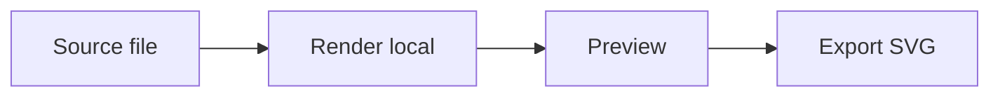
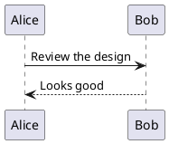
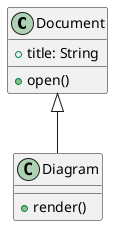
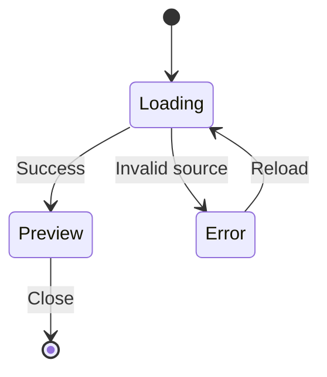

# Local diagrams

Open this file in simple.pdf. Diagrams render on your device, with no Java installation or diagram server.

## Mermaid flowchart

## PlantUML sequence

## PlantUML classes

## Mermaid state diagram

Use **Source** below a diagram to inspect or copy its definition. Use **Reload** (F5) after editing the file in another application.
